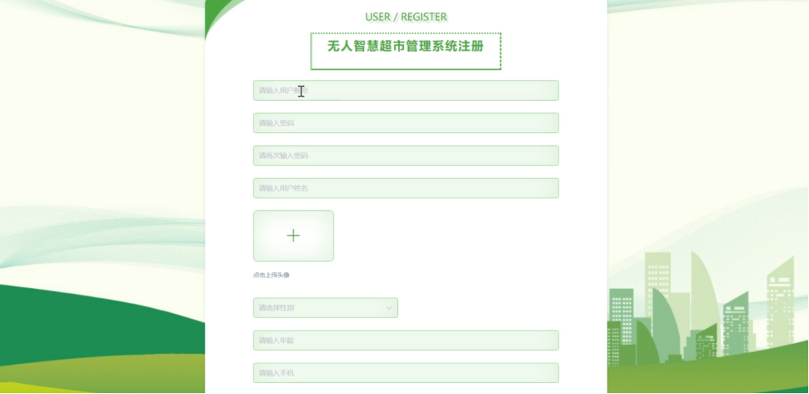
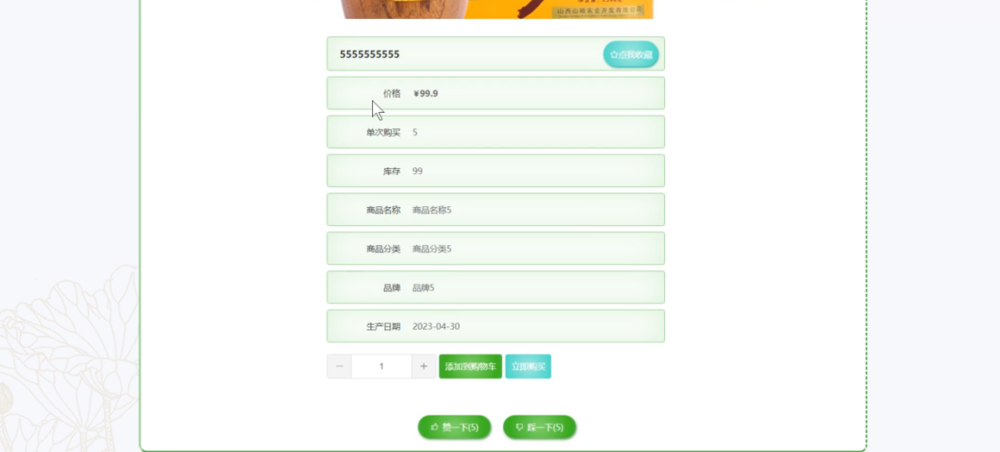
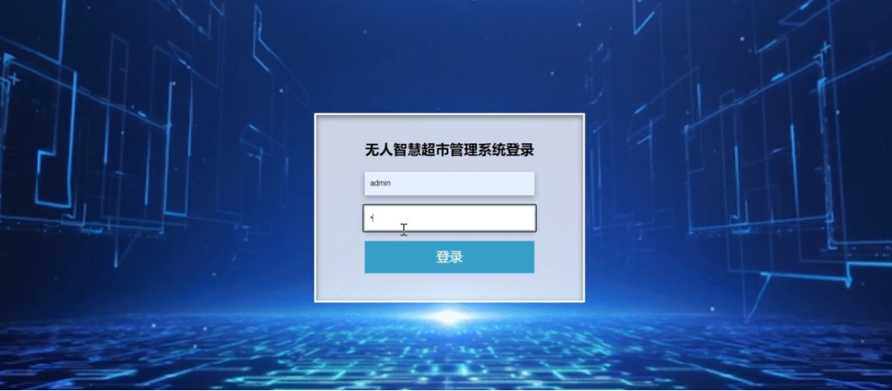
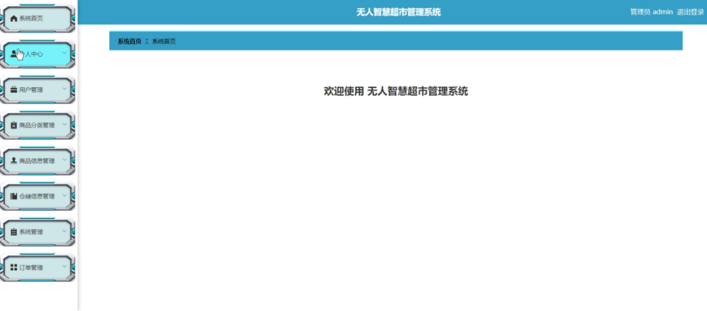
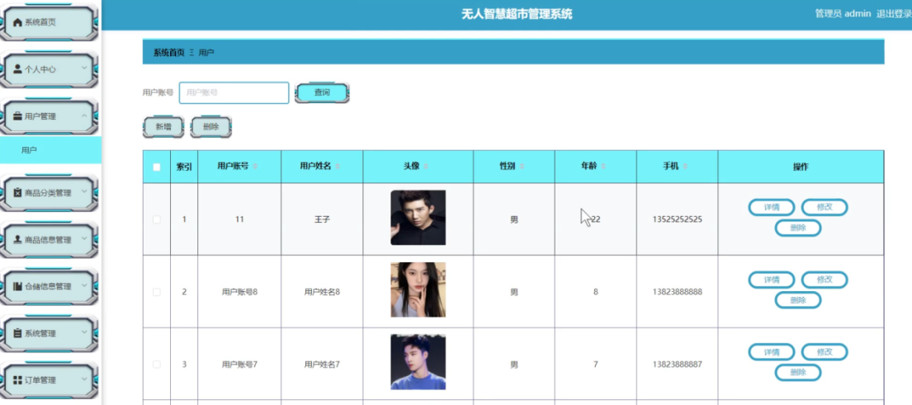
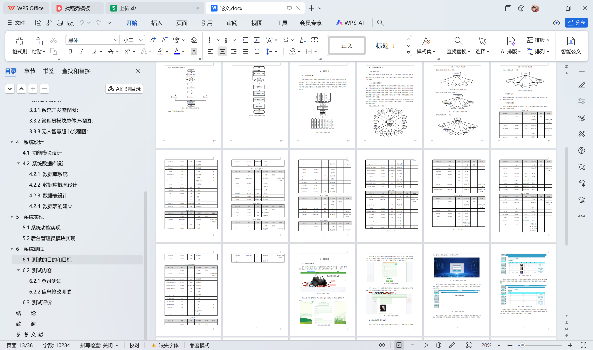

# springboot216-基于SpringBoot的无人智慧超市管理系统

>  博主介绍：
>  Hey，我是程序员Chaers，一个专注于计算机领域的程序员
>  十年大厂程序员全栈开发‍ 日常分享项目经验 解决技术难题与技术推荐 承接各类网站设计，小程序开发，毕设等。
>  【计算机专业课程设计，毕业设计项目，Java，微信小程序，安卓APP都可以做，不仅仅是计算机专业，其它专业都可以】

## 3000套系统可挑选，获取链接：https://chaerspol.github.io/

<b>QQ【获取完整源码】：674456564</b>

<b>QQ群【获取完整源码】：1058861570</b>

### 系统架构

> 前端：html | js | css | jquery | vue
>
> 后端：springboot | mybatis
> 
> 环境：jdk1.8+ | mysql | maven

# 一、内容包括
包括有  项目源码+项目论文+数据库源码+答辩ppt+远程调试成功

# 二、运行环境

> jdk版本：1.8 及以上； ide工具：IDEA； 数据库: mysql5.7及以上；编程语言: Java

# 三、需求分析

**3.1 可行性分析**

根据无人智慧超市管理系统的功能，通过对经济可行性、技术可行性和法律可行性分析进行全面的分析，提供准确的可行性依据。以下是本系统的可行性分析:

(1)经济可行性

就是分析在现有经济情况下能否完成本无人智慧超市管理系统的开发。下面对本系统开发、运行、维护的相关费用评估，以及投入到实际运用中完成无人智慧超市可能费用进行估算。网络资源丰富，本无人智慧超市管理系统只需使用任选一开源服务器即可，此方面无需投入费用。开发阶段，由于本无人智慧超市管理系统不属于大型系统，常规的电脑就可完成开发，不用购置相关硬件设备。软件方面，本无人智慧超市管理系统只需使用网上免费下载的软件即可完成开发，这些软件在使用时简单易懂，无需培训，因此在开发方面也无需投入费用。由于本无人智慧超市管理系统不属于大型系统，运行时候电费可以忽略不记。无人智慧超市管理系统作为自己毕设，由本人开发即可完成，无需人力费用。综上，整个系统开发花费很少，所以本无人智慧超市管理系统在经济上可行。

(2)技术可行性

本系统的开发使用java作为系统开发的开发语言，开发工具选择 Eclipse，而 B/S架构决定了本系统的兼容性和多用户可操作性，此外选择MySql作为数据库不仅提高了数据安全性更保障了数据的可操作性。

(3) 法律可行性分析

法律可行性分析，即分析本无人智慧超市管理系统是否与各类法律相悖。本无人智慧超市管理系统使用市面开源免费软件开发，且作为个人毕设，无商用，均为本人自主开发，并且页面设计合理，发布的信息要求符合常规。整个系统无抵触法律法规的问题。因此在法律上，本无人智慧超市管理系统可行。

**3.2 功能需求分析** 

无人智慧超市管理系统综合网络空间开发设计要求。目的是将无人智慧超市通过网络平台将传统管理方式转换为在网上管理，完成无人智慧超市的方便快捷、安全性高障，目标明确。无人智慧超市管理系统可以将功能划分为管理员的使用功能和用户使用的功能。

# 四、功能模块

无人智慧超市管理系统按照权限的类型进行划分，分为管理员和用户两个模块。系统实现个人中心、用户管理、商品分类管理、商品信息管理、仓储信息管理、系统管理、订单管理等功能进行操作，增强了使用者的操作体验。管理员模块主要针对整个系统的管理进行设计，提高了管理的效率和标准。系统的总体模块设计如下图所示。

# 五、效果图展示【部分效果图】

图5-1 系统首页界面【当人们打开系统的网址后，首先看到的就是首页界面。在这里，人们能够看到系统的导航条，通过导航条导航进入各功能展示页面进行操作。如图5-1所示】

图5-2系统注册页面【系统注册：在注册页面输入用户注册信息进行注册操作，系统注册页面如图5-2所示】

图5-3商品信息详细界面【商品信息：在商品信息列表页面的输入栏中输入商品名称、商品分类和价格进行查询，可以查看到商品信息详细，并根据需要对商品信息详情信息进行添加到购物车、立即购买、收藏、赞一下、踩一下或评论等操作；如图5-3所示】

图5-4个人中心详细界面【个人中心：在个人中心页面通过填写个人详细信息进行信息更新操作，还可以对我的订单和我的收藏进行详细操作；如图5-4所示】

图5-5 后台管理员登录界面【后台管理员登录，在登录页面选择需要登录的角色，在正确输入用户名和密码后，进入操作系统进行操作；如图5-5所示】

图5-6管理员主界面【管理员进入主页面，主要功能包括对个人中心、用户管理、商品分类管理、商品信息管理、仓储信息管理、系统管理、订单管理等进行操作。管理员主界面如图5-6所示】

图5-7用户管理界面【管理员点击用户管理。在用户页面输入用户账号可以查询、新增或删除用户列表，并根据需要对用户详细信息进行查看详情、修改或删除操作，如图5-7所示】

 <b>完整文章</b>
 

 

## 3000套系统可挑选，获取链接：https://chaerspol.github.io/

<b>QQ【获取完整源码】：674456564</b>

<b>QQ群【获取完整源码】：1058861570</b>

